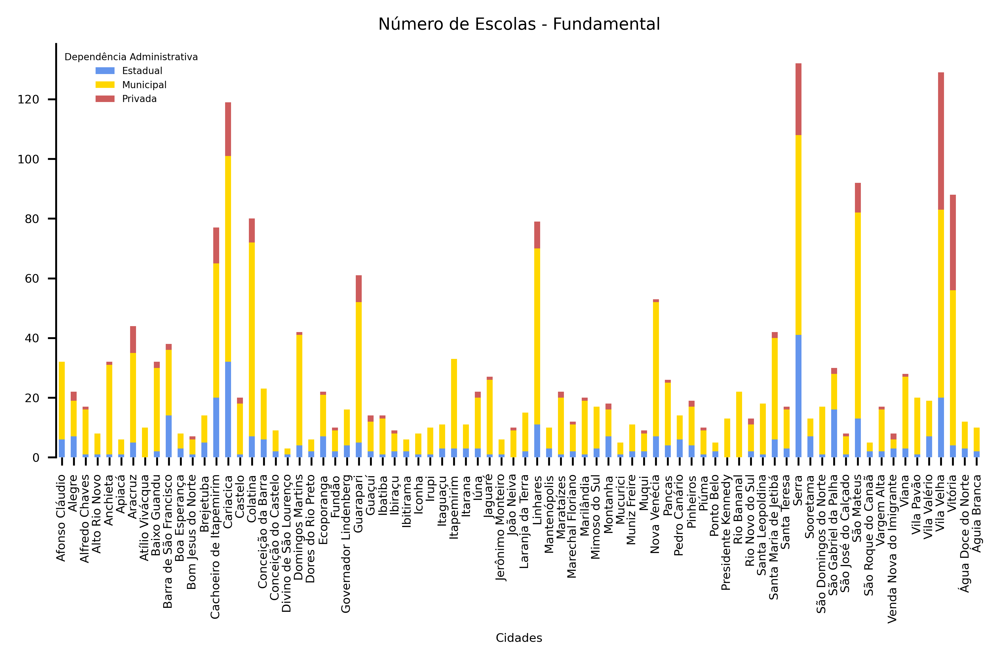

# Portifolio Project - Educação ES

In this code I analysed educational data from my home state using data from Instituto Nacional de Estudos e Pesquisas Educacionais Anísio Teixeira (INEP). The institute is responsible for promoting studies, research and periodic evaluations on the Brazilian educational system, with the objective of subsidizing the formulation and implementation of public policies for the educational area.

This is an analisys of elementary schools per cities aggregating them by their administrative instance (municipal, state, federal or private).

**Elementary**

**Middle School**

As expected most of elementary teaching is done by the city administrative instance while most of middle school teaching is done by the state administrative instance. The federal constitution defines that the municipality takes care of early childhood Education and also elementary school 1; Middle school is a priority for the state government, but they also manage elementary schoool 2. The Union, in turn, is responsible for the financial and technical coordination while conducting the federal universities.

Also did an analyze of number os students per school in elementary and middle school. For this I used data from public schools of my home state.

**Elementary**

**Middle School**

